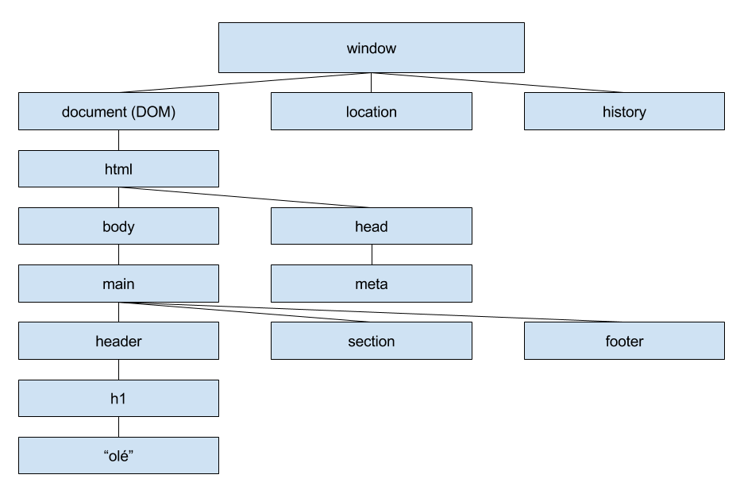

## Le DOM

C'est quoi ?


***


## Définition

Lorsqu'un navigateur charge une page, celui-ci crée un DOM. Ce dernier est une arborescence d'objets qui correspondent aux éléments de la page web.


***





***


## Pause pratique

1. Ouvrez [blank.bellevillecitoyenne.fr](http://blank.bellevillecitoyenne.fr)
2. Appuyez sur `Ctrl + Shift + j`
3. Allez dans la console
4. Tapez `window`
5. Observez cet objet javascript
6. Ok ça fait beaucoup de truc non ? <!-- .element: class="fragment" -->


***


## Regardez les objets suivants :

1. `window.location`
2. `window.history`
3. `window.document`


***


## Que constatez-vous ?
Notes: Les 2 premiers sont des objets javascript mais le 3e ressemble à juste du HTML imprimé dans la console.


***


## A quoi servent `location` et `history` ?
Ils servent respectivement à manipuler l'adresse courante. Voir [ici](https://developer.mozilla.org/en-US/docs/Web/API/Window/location) pour les intéressés.
History sert à manipuler l'historique du visiteur. Voir [ici](https://developer.mozilla.org/en-US/docs/Web/API/Window/history) pour les intéressés.


***


## Petit exercice :
Changez l'url courante en modifiant la propriété `href` de l'objet `window.location`.


---


## Parlons du DOM !
Le DOM va nous permettre de manipuler les éléments HTML, les modifier, en ajouter, en enlever en fonction des actions d'un utilisateur.

Chaque élément du DOM est un objet correspondant à un élément HTML. Cela signifie qu'ils possèdent des propriétés et des méthodes qui leur sont propres.


---


## Manipuler le DOM


***


## Récupérer des éléments HTML

* `document.getElementsByTagName("balise")` : Retourne la liste des élements HTML


* `document.getElementById("id que l'on veut chercher)` : Retourne le premier élément dans le DOM ayant l'id passée en paramètre.


* `document.getElementsByClassName(name)` Retourne la liste des éléments HTML qui portent la classe.


***


* `document.querySelector("queryselector")` et `document.querySelectorAll("queryselector")` Retournent respectivement le premier ou la liste des élements correspondant à la liste de sélecteurs donnée.

* `element.getAttribute("attributename")` Récupère la valeur de l'attribut demandé sur l'élément initial.


***


## Modifier les éléments HTML

* `element.innerHTML = "new html content"` Change le contenu d'une balise (peut-être du texte, ou de l'HTML).

* `element.attribute = "new value"` Change la valeur d'un attribut HTML.

* `element.setAttribute(attribute, value)` Change ou créé la valeur d'un attribut.

* `element.style.{styleproperty} = "value"` Change la valeur de la propriété CSS voulue.


***


## Adding and Deleting Elements

* `document.createElement("tagname")` Créé un élément HTML (on passe le nom de la balise que l'on veut créer en paramètre).

* `element.appendChild(htmlelement)` Ajoute un élément HTML en tant qu'enfant de l'élément sur lequel on appelle la méthode.

* `element.removeChild(element)` Supprime l'enfant passé en paramètre.

* `element.replaceChild(element)` Remplace un élément HTML.


---


## Les événements


***


## C'est quoi ?
Les événéments en JS sont en fait des instructions qui sont déclanchées par une intervention extérieure (mousehover, click, etc.).


***


## Comment fait-on ?

On a trois choix :

* Soit on utilise les attributs HTML spécifiques pour ça : `onclick`, `onmousehover`, `onmouseout`, `onmousedown`, `onmouseup`, `onchange`, etc. La liste complète [ici](http://www.w3schools.com/Tags/ref_eventattributes.asp)

* Soit on utilise le DOM HTML :
```js
document.getElementById("main-header").onhover = function(){
    document.getElementById("main-header").style.opacity = "0";
};
```


***


* Soit on ajoute un "event listener" :

```js
var myHTMLElement = document.getElementById("main-header");
myHTMLElement.addEventListener("click", ole);

function ole() {
    alert("COUCOU !");
}
```

*PS : Cette dernière méthode est plus complexe mais offre plus de possibilités. Ex : Plusieurs fonctions pour le même événement, plus maintenable, etc.*


***


## Juste pour la culture !
Il y a deux types de propagation d'événements :
* Bubbling
* Capturing

```html
<section onclick="ole();">
    <header onclick="haha();">
    ...
    </header>
</section>
```

*Quel click sera pris en compte en premier si on clique sur le header ? Et dans quel cas ?*


***


## Réponse !
Dans le cas d'un "bubbling", le premier élément qui est affecté par l'événement et celui le plus bas dans l'arborescence, dans ce cas, le `header`, et ensuite la `section`.

Dans le cas d'un "capturing", le premier élément qui est affecté par l'événement et celui le plus heut dans l'arborescence, dans ce cas, la `section`, et ensuite le `header`.


***


## Voilà
Maintenant vous connaissez l'essentiel de JavaScript. Il reste quelques petites choses comme les timers, ajax etc. On voit ça bientôt.

Maintenant aux exercices !
